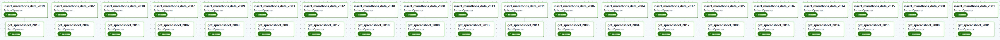
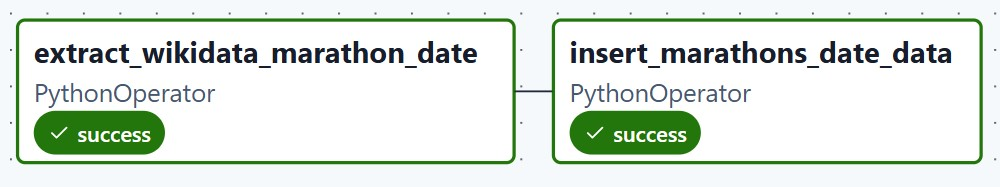
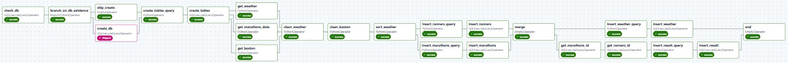
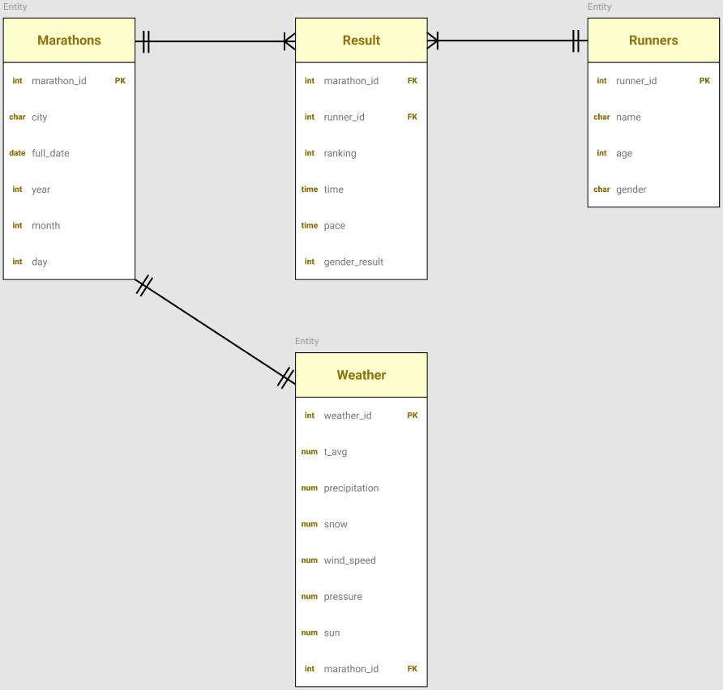
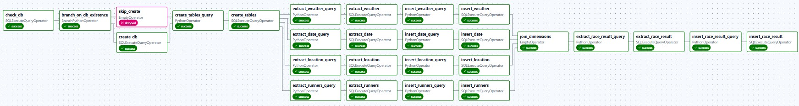
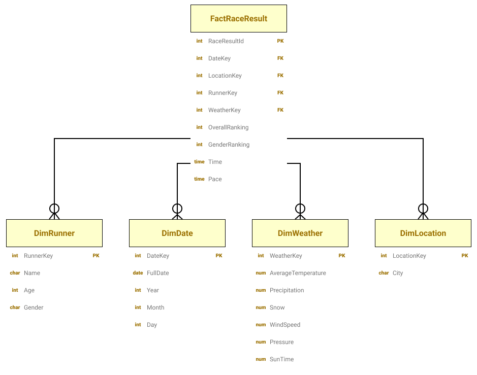

# Boston Marathons Performance X Weather Conditions


Project [DATA Engineering](https://www.riccardotommasini.com/courses/dataeng-insa-ot/) is provided by [INSA Lyon](https://www.insa-lyon.fr/).

## Table of Contents

1. [Collaborators](#collaborators)
2. [Abstract](#abstract)
   - [Context](#context)
   - [Our Project](#our-project)
3. [Getting Started](#getting-started)
4. [Notebook Explanation](#notebook-explanation)
5. [Pipeline Design](#pipeline-design)
   - [Input Datasets](#input-datasets)
   - [Ingestion Pipelines](#ingestion-pipelines)
   - [Staging Pipeline](#staging-pipeline)
   - [Production Pipeline](#production-pipeline)
6. [Queries](#queries)
7. [Project Delivery and Compliance](#project-delivery-and-compliance)
   - [Technical Stack and Justification](#technical-stack-and-justification)
   - [Core Requirements](#core-requirements)
   - [Additional Features](#additional-features)
8. [Environment Information](#environment-information)

## Collaborators

- Pitard-Bouet Aodren
- Getenet Mathis
- Venaille Arno

## Abstract

### Context

We are three INSA Lyon students passionate about running. As regular runners, we have experienced how weather conditions can impact our performance and observed how these effects can vary from one runner to another.  
These observations motivated us to investigate broader trends in the relationship between running performance and weather conditions, comparing large-scale data with individual experiences.  
We chose to focus on the marathon discipline (the premier discipline of distance running) and specifically on the oldest and one of the most prestigious marathons : the Boston Marathon.  
To balance data richness with computational feasibility, we selected the 2000-2019 period, providing two decades of runner and weather data.

### Our project

Our project investigates the relationship between Boston Marathon runner performance and weather conditions between 2000 and 2019.  
Specifically, we address three analytical questions :

1. (request 1 details)
2. (request 2 details)
3. (request 3 details)

To conduct this analysis, we built an integrated analytical database using five automated Airflow pipelines (three for data ingestion, one for data transformation and one for production data). Instructions for executing these pipelines and constructing the final database are detailed in the following section.  
Our final database combines data from three sources :

- A GitHub repository containing the CSV files of the results of each Boston Marathon edition ;
- Wikidata to collect the dates of each Boston marathon edition ;
- Meteostat (a python library) to collect daily weather data for Boston from 2000 to 2019.

The complete pipeline architecture and dataset specifications are detailed in the "Pipeline Design" section, while query results and analytical findings are presented in the "Queries" section.

## Getting Started

1. Download or clone this repository ;
2. With your favorite CLI, open the downloaded/cloned folder ;
3. Run "docker compose up -d" and wait for the process to complete (this may take a few minutes) ;
4. Open your favorite web browser and navigate to "http://localhost:8888/notebooks/project.ipynb" ;
5. You can now execute each code cell in order. Make sure to wait for each cell to finish running before launching the next one.

## Notebook explanation

The idea behind the notebook is to centralize all the steps required to run the project in a single place, so the user doesn't have to create connections in the Airflow UI or manually trigger each pipeline, for example.  
Concretely, the notebook allows the user to :

1. Authenticate and obtain a **jwt token** for subsequent requests to the Airflow API.
2. Create the **necessary connections** between Airflow Server and our Databases (MongoDB, Postgres : default, staging and production).
3. Trigger the **three ingestion pipelines** and wait for their completion.
4. Trigger the **staging pipeline** and wait for its completion.
5. Trigger the **production pipeline** and wait for its completion.
6. Execute the **three analytical requests** and perform **some data science** on the resulting outputs.

## Pipeline Design

(TODO : Put a schema with the technologies used)

### Input Datasets

**Boston Marathons Race Results : First Dataset**  
We are fetching the Boston Marathons race results from 2000 to 2019 from the github repository https://github.com/adrian3/Boston-Marathon-Data-Project. For each year, a CSV file is retrieved containing the results of each participant.  
The structure of the CSV files from 2000 to 2015 is as follows (example showing the header and the first two lines of the 2000 CSV file) :  
| display_name | age | gender | residence | pace | official_time | overall | gender_result | division_result | seconds | first_name | last_name |
|--------------|-----|--------|---------------|----------|---------------|---------|---------------|-----------------|---------|------------|-----------|
| Gezahenge Abera | 22 | M | Addis Ababa | 00:04:56 | 2:09:47 | 1 | 1 | 1 | 7787 | Gezahenge | Abera |
| Elijah Lagat | 33 | M | Nandi District | 00:04:56 | 2:09:47 | 1 | 1 | 1 | 7787 | Elijah | Lagat |

The structure of the CSV files from 2015 to 2019 is as follows (example showing the header and the first two lines of the 2019 CSV file) :

| place_overall | bib | name              | age | gender | city    | state | country_residence | country_citizenship | name_suffix | 5k   | 10k  | 15k  | 20k  | half | 25k  | 30k  | 35k  | 40k  | pace | projected_time | official_time | overall | gender_result | division_result | seconds | first_name | last_name | display_name     |
| ------------- | --- | ----------------- | --- | ------ | ------- | ----- | ----------------- | ------------------- | ----------- | ---- | ---- | ---- | ---- | ---- | ---- | ---- | ---- | ---- | ---- | -------------- | ------------- | ------- | ------------- | --------------- | ------- | ---------- | --------- | ---------------- |
| 1             | 2   | Cherono, Lawrence | 30  | M      | Eldoret | ""    | Kenya             | Kenya               | NULL        | NULL | NULL | NULL | NULL | NULL | NULL | NULL | NULL | NULL | NULL | NULL           | 2:07:57       | 1       | 1             | 1               | 7677    | NULL       | NULL      | Lawrence Cherono |
| 2             | 6   | Desisa, Lelisa    | 29  | M      | Ambo    | ""    | Ethiopi           | Ethiopi             | NULL        | NULL | NULL | NULL | NULL | NULL | NULL | NULL | NULL | NULL | NULL | NULL           | 2:07:59       | 2       | 2             | 2               | 7679    | NULL       | NULL      | Lelisa Desisa    |

As you can see, there are two main things to notice :

- Missing and Null values : Many fields contain empty strings, NULL values, or missing data ;
- Heterogeneous schema : Two different dataset structures require normalization and merging during the staging pipeline.
  These challenges will be addressed in the data treatment process described in the staging pipeline section.

**Boston Marathon Official Dates : Complementary Dataset**  
As shown in the previous example, the race results data only contains the year of each Boston Marathon edition from 1897 to 2022. However, to match the race results with weather conditions, we need the exact date of each edition. To achieve this, we query Wikidata using SPARQL and extract the response into a CSV file with the following structure (example showing the header and the first two lines) :

| marathon        | edition              | date       | location |
| --------------- | -------------------- | ---------- | -------- |
| Boston Marathon | 1897 Boston Marathon | 1897-04-19 | Boston   |
| Boston Marathon | 1898 Boston Marathon | 1898-04-19 | Boston   |

**Weather Data : Second Dataset**  
We are fetching the weather data for Boston for each day from January 1st, 2000 to December 31st, 2019. To achieve this, we are using the Python _meteostat_ library and storing the response into a JSON file. _Meteostat_ is an open-source Python library that provides easy access to historical weather and climate data from weather stations worldwide, allowing us to retrieve meteorological observations : average temperature (tavg), minimum temperature (tmin), maximum temperature (tmax), precipitation (prcp), snow depth (snow), wind direction (wdir), wind speed (wspd), wind peak gust (wpgt), atmospheric pressure (pres) and sunshine duration (tsun).  
The structure of the JSON file is as follows (partial view shown as the full file contains 7305 daily records for each parameter) :

```json
{
   "tavg": {"946684800000": 3.9, "946771200000": 6.7, ... },
   "tmin": {"946684800000": -2.8, "946771200000": 1.1, ...},
   "tmax": {"946684800000": 10, "946771200000": 12.2, ...},
   "prcp": {"946684800000": 0, "946771200000": 0.8, ...},
   "snow": {"946684800000": 0, "946771200000": 0, ...},
   "wdir": {"946684800000": null, "946771200000": null, ...},
   "wspd": {"946684800000": 18.4, "946771200000": 14.4, ...},
   "wpgt": {"946684800000": null, "946771200000": null, ...},
   "pres": {"946684800000": 1022.9, "946771200000": 1019.4, ...},
   "tsun": {"946684800000": null, "946771200000": null, ...}
}
```

This structure contains meteorological parameters where:

- the keys are Unix timestamps in milliseconds ;
- the values are measurements in their respective units.

The weather data presents two structural considerations:

- Missing values : There are sometimes NULL values in the dataset ;
- Parameter-based structure : The data is structured by meteorological parameters rather than by date, requiring transformation to a date-indexed format for efficient association with marathon dates.

These challenges will be addressed in the data treatment process described in the staging pipeline section.

### Ingestion Pipelines

At the end of this step, we will have three MongoDB databases :

- one for Boston Marathon race results from 2000 to 2019 ;
- one for Boston Marathon official dates from 1897 to 2022 ;
- one for the daily weather data of Boston from January 1st, 2015 to December 31st, 2019.

**Ingestion of Boston Marathons data**



The aim of the pipeline above is to ingest 20 CSV files containing Boston Marathon race results from 2000 to 2019 and bring it to the landing zone (a MongoDB collection).  
The data pipeline consists of 20 parallel tasks. Each task is responsible for ingesting one CSV file (representing data for one edition of the Boston Marathon) and follows a consistent two-step pattern:

1. A BashOperator (get_spreadsheet\_{year}) : Retrieves the CSV file from the GitHub repository (mentioned in the 'Input Datasets' section).
2. A PythonOperator (insert_marathons_data\_{year}) : Inserts the collected raw data into the MongoDB database.

The pipeline can be executed multiple times without inserting duplicates. During insertion, each record is assigned a unique ID by combining the overall ranking and the edition year (example : `1_2019` for the first-place finisher in 2019). A unique index is created on this ID field in the MongoDB database, ensuring that any attempt to insert a duplicate record will be rejected.

At the end of the ingestion, there are `289284` records in the Mongo database.

**Ingestion of Boston Marathons dates**



The aim of the pipeline above is to ingest the Boston Marathon official dates from 1897 to 2022 (data is not available beyond 2022) and bring it to the landing zone (a MongoDB collecion).  
The data pipeline consists of two sequential tasks :

1. A PythonOperator (extract_wikidata_marathon_date) : Uses the python library `SPARQLWrapper` to query Wikidata for the exact date of each Boston Marathon edition and extracts the results into a CSV file.
2. A PythonOperator (insert_marathons_date_data) : Inserts the collected raw data into the MongoDB database.

The pipeline can be executed multiple times without inserting duplicates. Indeed, a unique index is created on the `edition` field in the MongoDB database, ensuring that any attempt to insert a duplicate record will be rejected.

At the end of the ingestion, there are `126` records in the Mongo database (one for each Boston Marathon from 1897 to 2022).

**Ingestion of Weather Data**


The aim of the pipeline above is to ingest the daily weather data of Boston from January 1st, 2015 to December 31st, 2019 and bring it to the landing zone (a MongoDB collection).  
The data pipeline consists of two sequential tasks :

1. A PythonOperator (run_weather_script) : Uses the python library `meteostat` to query and retrieve historical weather data for Boston.
2. A PythonOperator (insert_weather_data) : Inserts the collected raw data into the MongoDB database.

The pipeline can be executed multiple times without inserting duplicates. During insertion, the JSON document is assigned a unique ID which is the name of the city (Boston here). A unique index is created on this ID field in the MongoDB database, ensuring that any attempt to insert a duplicate record will be rejected.

At the end of the ingestion, there are `1` record in the Mongo database containing `7305` daily records (one for each day from 2000 to 2019) across all meteorological parameters (listed in the 'Input Datasets' section).

### Staging Pipeline

**The DAG**



The pipeline above has multiple aims :

- Migrate raw data from the landing zone into the staging area ;
- Clean, transform, wrangle, enrich the data ;
- Persist the processed data into an OLTP database.

More specifically, here is a table describing each operator in the pipeline above :
| Name | Type | Role |
| --------------- | -------------------- | ---------- |
| check_db | SQLExecuteQueryOperator | Verify the existence of the Postgres staging database by querying the system catalog. |
| branch_on_db_existence | BranchPythonOperator | Based on the previous output, branch to create the database or skip creation. |
| skip_create | EmptyOperator | Does nothing, enable the branching. |
| create_db | SQLExecuteQueryOperator | Create the staging database. |
| create_tables_query | PythonOperator | Write the queries in a SQL file for creating the database tables. |
| create_tables | SQLExecuteQueryOperator | Execute the previous queries in the staging database. |
| get_weather | PythonOperator | Migrate weather data from the landing zone (MongoDB collection) into a CSV file. |
| get_marathons_date | PythonOperator | Migrate Boston Marathon dates data from the landing zone (MongoDB collection) into a CSV file. |
| get_boston | PythonOperator | Migrate Boston Marathon race results data from the landing zone (MongoDB collection) into a CSV file. |
| clean_weather | PythonOperator | Clean weather data (more details below) and write the cleaned data into a CSV file. |
| clean_boston | PythonOperator | Clean Boston Marathon data (race results and official dates, more details below) and write the cleaned data into three different CSV files. |
| sort_weather | PythonOperator | Save in a CSV file only daily weather data corresponding to Boston Marathon race dates. |
| insert_runners_query | PythonOperator | Write the query in a SQL file for inserting Runners data into the 'Runners' table. |
| insert_runners | SQLExecuteQueryOperator | Execute the previous query in the staging database. |
| insert_marathons_query | PythonOperator | Write the query in a SQL file for inserting Marathons data into the 'Marathons' table. |
| insert_marathons | SQLExecuteQueryOperator | Execute the previous query in the staging database. |
| merge | EmptyOperator | Merge the two parallel process of the DAG, do nothing. |
| insert_weather_query | PythonOperator | Write the query in a SQL file for inserting Weather data into the 'Weather' table. |
| insert_weather | SQLExecuteQueryOperator | Execute the previous query in the staging database. |
| get_marathons_id | SQLExecuteQueryOperator | Get from the staging database the id of each marathon with the corresponding year (OPTIMISATION). |
| get_runners_id | SQLExecuteQueryOperator | Get from the staging database the id of each runner with the corresponding age and name (OPTIMISATION). |
| insert_result_query | PythonOperator | Write the query in a SQL file for inserting Result data into the 'Result' table. The optimisations above avoid executing nested subqueries for each row to fetch marathon_id and runner_id. |
| insert_result | SQLExecuteQueryOperator | Execute the previous query in the staging database. |
| end | EmptyOperator | End of the DAG, do nothing. |

**Boston Marathon Data Cleaning and Transformation Explanation**

This step corresponds to the **'clean_boston'** task.

Input files :

- "boston_date.csv" containing the date of each Boston Marathon edition ;
- "boston_data.csv" containing the results of each runner for the Boston Marathons from 2000 to 2019.

Output files :

- "table_marathons.csv" containing the data to be inserted in the table "Marathons" of the OLTP database ;
- "table_result.csv" containing the data to be inserted in the table "Result" of the OLTP database ;
- "table_runners.csv" containing the data to be inserted in the table "Runners" of the OLTP database.

Data Cleaning Steps :

1. Pace Calculation : For each runner's official time, calculate the pace in minutes per kilometer by dividing total seconds by 42.195 km and reformating it. Invalid time formats or values are set to null.
2. Column Selection : Keep only relevant columns (overall ranking, official time, gender result, edition year, display name, age, gender and pace).
3. Name Encoding Fix : Detect and fix UTF-8 encoding issues in runner names (characters like Ã, Â, Á) by re-encoding from latin1 to UTF-8.
4. Name Validation : Remove rows with corrupted or invalid names containing remaining special characters, corruption patterns, or encoding artifacts (�, ·, ¯, etc.).
5. Null Removal : Drop any remaining rows with missing values to ensure data integrity.
6. Data Splitting : Transform the cleaned dataset into three normalized tables :
   - Runners : Unique runners with name, age and gender (duplicates removed) ;
   - Results : Race results linking runners to marathons with ranking, time, pace and gender result ;
   - Marathons : Marathon editions with the edition year.
7. Enrich Marathons Data : For Marathons, enrich with the date of each edition coming from "boston_date.csv" input file and the name of the city.
8. Save Splitted Data : Save the splitted data into the corresponding output files.

**Weather Data Cleaning Explanation**

This step corresponds to the **'clean_weather'** task.  
Input file : "weather_data.csv" with the following structure :
| tavg.946684800000 | tavg.946771200000 | tavg.946857600000 | tavg.946944000000 | ... |
|---------------|------|--------|------|------|
| 3.9 | 6.7 | 12.2 | 11.1 | ... |

Keeps going like this for each day for each parameter.

Output file : "cleaned_weather_data.csv" with the following structure (two first lines with the header)
| date | prcp | pres | snow | tavg | tmax | tmin | tsun | wdir | wpgt | wspd |
|------------------------------|------|--------|------|------|------|------|------|------|------|------|
| 2000-01-01 00:00:00+00:00 | 0.0 | 1022.9 | 0.0 | 3.9 | 10.0 | -2.8 | | | | 18.4 |
| 2000-01-02 00:00:00+00:00 | 0.8 | 1019.4 | 0.0 | 6.7 | 12.2 | 1.1 | | | | 14.4 |

As illustrated, the goal is to reorganize the data so that each row represents all weather parameters for a given day, rather than having separate daily records for each parameter. This structure makes it easier to match weather conditions to the specific dates of Boston Marathon editions.

Then, the **'sort_weather'** task takes two input files :

- "cleaned_weather_data.csv" (output from 'clean_weather' task) ;
- "table_marathons.csv" (output from 'clean_boston' task).

It filters the weather data to retain only dates matching Boston Marathon editions and selects relevant weather parameters : average temperature (tavg), precipitation (prcp), snow depth (snow), wind speed (wspd), atmospheric pressure (pres), and sunshine duration (tsun).  
The output is saved as a CSV file.
See below (the first two lines with the header) :
| date | prcp | pres | tsun | tavg | wspd | snow |
| --- | --- | --- | --- | --- | --- | --- |
| 2000-04-17 | 0.0 | 1023.7 | | 6.7 | 22.7 | 0.0 |
| 2001-04-16 | 0.0 | 1007.1 | 0.0 | 6.1 | 15.5 | 0.0 |

**OLTP Database**

At the end of the pipeline, we have an OLTP database into PostgreSQL with the following schema :  


The pipeline can be executed multiple times without inserting duplicates into the OLTP database.  
Indeed, constraints are created for each table of the database :

- Marathons : Unique constraint on (city, year) ;
- Runners : Unique constraint on (name, age) ;
- Weather : Unique constraint on (marathon_id) ;
- Result : Unique constraint on (marathon_id, runner_id).

### Production Pipeline

**The DAG**


<br>

The pipeline above has multiple aims :

- Automatically manage the lifecycle of the production database by checking for its existence, creating the database if missing, and initializing the required table schemas.
- Extracting raw data, processing it to generate SQL scripts, and loading it into the target tables.
- Transform the raw relational data into an OLAP Star Schema optimized for analytics. 
- The data is restructured into a central Fact table (`FactRaceResult`) connected to four Dimensions (`DimWeather`, `DimRunner`, `DimLocation`, `DimDate`).

More specifically, here is a table describing each operator in the pipeline above :
| Name | Type | Role |
| --------------- | -------------------- | ---------- |
| check_db | SQLExecuteQueryOperator | Checks whether the cursor returned at least one row, meaning the production database already exists. |
| branch | BranchPythonOperator | Branches depending on whether the production database exists. |
| create_db | SQLExecuteQueryOperator | Creates the production database if it does not exist. |
| skip_create | EmptyOperator | Skips the database creation step if the database already exists. |
| create_tables_query | PythonOperator | Creates a SQL file containing queries to create the database tables if they do not exist. |
| create_tables | SQLExecuteQueryOperator | Executes the generated SQL file to create tables in the production database. |
| extract_runners_query | PythonOperator | Creates a SQL file containing a query to extract all runners from the staging database. |
| extract_weather_query | PythonOperator | Creates a SQL file containing a query to extract the weather data from the staging database. |
| extract_date_query | PythonOperator | Creates a SQL file containing a query to extract Boston Marathons dates from the staging database. |
| extract_location_query | PythonOperator | Creates a SQL file containing a query to extract the different city of marathons from the staging database. |
| extract_race_result_query | PythonOperator | Creates a SQL file containing a query to extract all race results from the staging database. |
| extract_runners | SQLExecuteQueryOperator | Exports query results about runners data from a database cursor into a CSV file. |
| extract_weather | SQLExecuteQueryOperator | Exports query results about weather data from a database cursor into a CSV file. |
| extract_date | SQLExecuteQueryOperator | Exports query results about Boston Marathons dates from a database cursor into a CSV file. |
| extract_location | SQLExecuteQueryOperator | Exports query results about location data from a database cursor into a CSV file. |
| extract_race_result | SQLExecuteQueryOperator | Exports query results about race results from a database cursor into a CSV file. |
| insert_runners_query | PythonOperator | Creates a SQL file containing a query to insert runners data to the DimRunner of the production pipeline. |
| insert_weather_query | PythonOperator | Creates a SQL file containing a query to insert weather data to the DimWeather of the production pipeline. |
| insert_date_query | PythonOperator | Creates a SQL file containing a query to insert dates to the DimDate of the production pipeline. |
| insert_location_query | PythonOperator | Creates a SQL file containing a query to insert location data to the DimLocation of the production pipeline. |
| insert_race_result_query | PythonOperator | Creates a SQL file containing a query to insert race results data to the FactRaceResult of the production pipeline. |
| insert_runners | SQLExecuteQueryOperator | Executes the generated SQL to insert runners data into the production database. |
| insert_weather | SQLExecuteQueryOperator | Executes the generated SQL to insert weather data into the production database. |
| insert_date | SQLExecuteQueryOperator | Executes the generated SQL to insert date data into the production database. |
| insert_location | SQLExecuteQueryOperator | Executes the generated SQL to insert location data into the production database. |
| insert_race_result | SQLExecuteQueryOperator | Executes the generated SQL to insert race results data into the production database. |
| join_dimensions | EmptyOperator | Synchronizes the pipeline to ensure dimension tables are processed. |

<br>

**OLAP Database**

At the end of the pipeline, we have an OLAP database into PostgreSQL with the following schema :  

<br>

<br>

We will use this production database to execute our queries, see details in the next section.

## Queries (EN COURS, A COMPLETER AVEC RESULTATS)

### 1. Atmospheric Impact on Gender Performance
**Goal:** Analyze how specific weather metrics (Atmospheric Pressure, Temperature, Precipitation) correlate with the average finish time for Male and Female runners.
* **Logic:** Calculate the average time of the **Top 100 runners** for each marathon, grouped by gender, and correlated with the atmospheric pressure and temperature recorded for that specific event.
* **Insight:** Determine if specific genders are more resilient to high/low pressure or extreme temperatures.

### 2. Historical Difficulty Ranking (Year-over-Year)
**Goal:** Create a "Difficulty Classification" of marathon editions based on the environmental conditions.
* **Logic:** Aggregate the average time of the **Top 1000 finishers** per year. Rank years from "Fastest" (Easiest) to "Slowest" (Hardest) and overlay weather conditions.
* **Insight:** Visualize the trend of performance over the years and identify outlier years caused by extreme weather events.

### 3. Cumulative Weather "Harshness" Score
**Goal:** Measure the impact of combined weather factors on different age groups.
* **Logic:** Compute a custom **Composite Weather Score** (e.g., `(Temp - 15)² + WindSpeed*0.5 + Precipitation*2`) for each race. Correlate this score with the average performance of the **Top 50 runners**, broken down by **Age Group** and **Gender**.
* **Insight:** Understand which age groups are most significantly affected by harsh weather conditions (composite stress).

## Project Delivery and Compliance
### Technical Stack and Justification

**End-to-End Workflow : Jupyter Notebook and Airflow**  

&nbsp;&nbsp;&nbsp;&nbsp;We chose to use Jupyter Notebook as the final frontend to configure the project, trigger pipeline execution, and create data visualizations. This choice is motivated by the need for an interactive and unified interface that combines code execution and visual output in a single environment. Furthermore, Jupyter Notebook significantly enhances user experience by eliminating the need to navigate to the Airflow API Server, for instance, for tasks such as creating database connections or triggering pipeline execution.  
All operations are centralized within the notebook, providing a streamlined and user-friendly interface.  

&nbsp;&nbsp;&nbsp;&nbsp;Airflow was mandatory for the project. However, beyond meeting this requirement, this tool enables us to orchestrate the complete dataflow.

**Ingestion Part : MongoDB**  

&nbsp;&nbsp;&nbsp;&nbsp;MongoDB was selected for the ingestion zone based on several key technical considerations :
- CP Model (CAP Theorem) : Prioritizes consistency and partition tolerance ; occasional unavailability is acceptable for ingestion operations.
- Intermediate Storage : Acts as a buffer between raw data sources (CSV/JSON files) and the staging zone, decoupling ingestion from transformation.
- Schema Flexibility : Essential for handling Boston Marathon CSV files with inconsistent structures across different years : all variants can be stored in a single collection without schema constraints.
- Indexing Support : Prevents already present records from being inserted into the ingestion database if pipelines are run again, ensuring data integrity.

**Staging Part : PostgreSQL**  

&nbsp;&nbsp;&nbsp;&nbsp;We selected PostgreSQL for the staging zone to persist data in an OLTP (Online Transaction Processing) database before migrating it to the final database (supporting OLAP queries) during the production pipeline. PostgreSQL was selected for the staging zone based on several key technical considerations :
- OLTP Architecture : The staging zone acts as a transactional layer where new data is loaded from the landing zone and undergoes cleaning, normalization, and validation operations. This OLTP approach allows us to defer the implementation of complex analytical structures, such as star schemas, until the production zone. Furthermore, OLTP systems are optimized for transactional workloads involving frequent read/write operations.
- CA Model (CAP Theorem) : PostgreSQL prioritizes Consistency and Availability (CA model), both critical for staging operations. Consistency ensures cleaned data maintains integrity across operations, while availability guarantees uninterrupted processing.
- Schema Enforcement via SQL : PostgreSQL's defined schemas validate cleaned and normalized data structures, acting as a quality gate.
- Indexing Support : Prevents already present records from being inserted into the staging database if pipelines are run again, ensuring data integrity.

**Production Part : PostgreSQL**  

&nbsp;&nbsp;&nbsp;&nbsp;We selected PostgreSQL for the production zone to persist data in a database supporting OLAP (Online Analytical Processing) queries. PostgreSQL was selected as the final analytical database based on several key technical considerations :
- CA Model (CAP Theorem) : PostgreSQL prioritizes Consistency and Availability (CA model), both critical for production operations. Consistency ensures cleaned data maintains integrity across operations, while availability guarantees uninterrupted processing.
- OLAP Query Support via Star Schema : Although PostgreSQL is traditionally optimized for OLTP workloads, implementing a star schema in the production zone significantly enhances its OLAP capabilities. The star schema reduces the number of joins required for analytical queries by denormalizing data into fact and dimension tables. This enables efficient aggregations and complex analytical queries typical of OLAP systems.
- Indexing Support : Avoid inserting duplicates in the production database.

### Core Requirements
- [x] Code well documented.
- [x] Docker-compose file to run the environment.
- [x] Detailed description of the various steps.
- [x] Report.
- [x] Pipelines can be run offline.
- [x] Minimum number of pipelines is 3.

### Additional Features
- [x] Include MongoDB for ingestion.
- [x] OLTP Database used in the staging zone.
- [x] All configurations, pipeline execution triggering and data visualization gathered in the notebook.

## Environment Information
| Service | Address | Username:Password
| ------- | ------- | ------- |
| Mongo | http://localhost:27017 | admin:admin |
| Mongo Express | http://localhost:8081 | admin:admin |
| Jupyter Notebook | http://localhost:8888 | / |
| PostgreSQL | http://localhost:5432 | airflow:airflow |
| PGAdmin | http://localhost:5050 | admin@admin.com:root |
| Airflow API Server | http://localhost:8080 | airflow:airflow |

