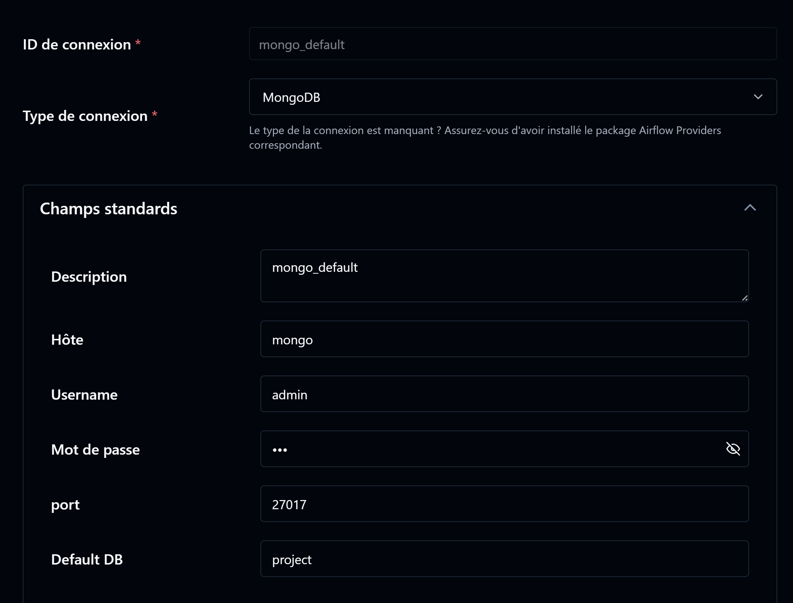
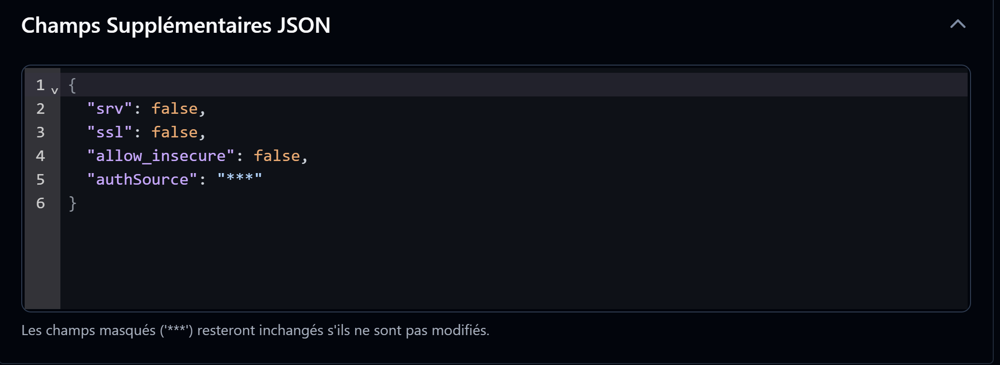

## Connect to MongoDB on Airflow Apiserver

Admin > Connexions > Ajouter une connexion

Suivez cette configuration :



Si l'option `mongo` pour `Type de Connexion` n'apparait pas, c'est qu'il faut rebuild :

```
docker-compose down
docker-compose up -d --build
```
